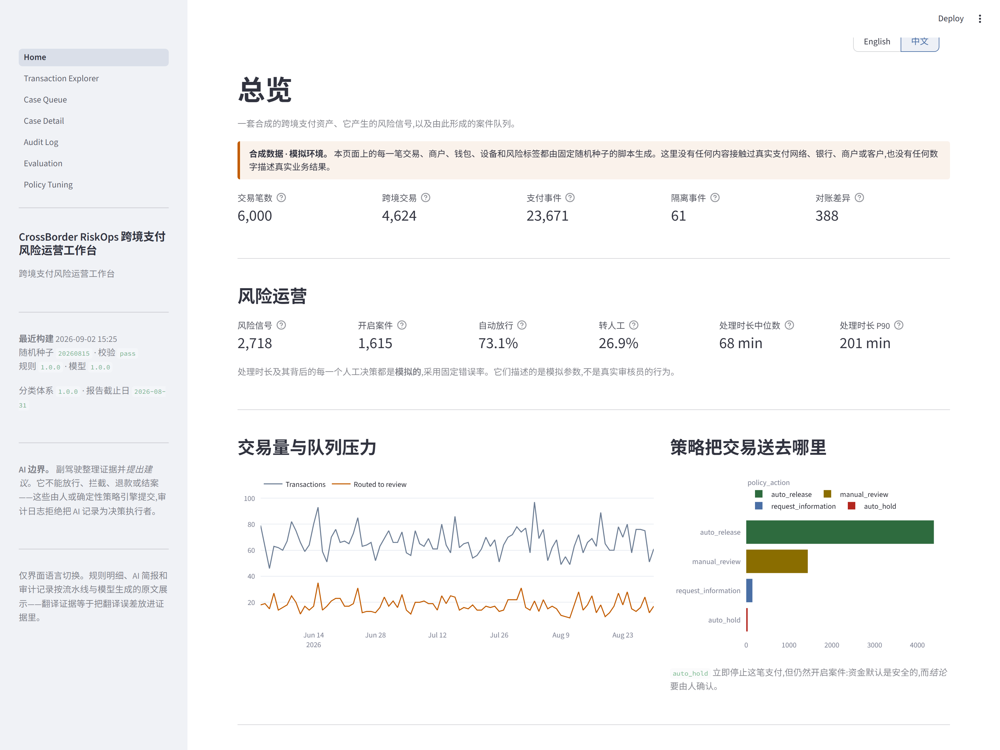

# CrossBorder RiskOps

[English](README.md) · **简体中文**

**跨境支付风险运营工作台——确定性规则找出风险,AI 副驾驶整理证据,人做决定。**

> ### ⚠️ 本项目所有数据均为合成数据
> 每一笔交易、商户、钱包、设备和风险标签都由固定随机种子的脚本生成。
> **这里没有任何内容接触过真实支付网络、银行、商户或客户。本系统从未在生产环境运行过,
> 从未经过任何监管机构或金融机构审查,也不隶属于任何支付公司。**
> *支付模型、规则、护栏、工作流和评测方案*是真实且可复现的;*数据population*是生成的。
> 详见 [TRUTH_AND_LIMITATIONS.md](docs/TRUTH_AND_LIMITATIONS.md)。


*左边是证据,右边是仅供参考的简报——然后一位被队列压着的分析师要求副驾驶「直接放行」,被拒绝了。
这个拒绝不是写在提示词里的:审计日志不接受把 AI 记录为决策执行者,所以它的回答没有任何路径能变成一个结果。*

---

## 问题

跨境支付出错的方式比国内支付多,而且**大部分不是欺诈**:

- 重试风暴让同一笔授权被扣款两次,一个真实客户被扣了两次钱。
- 结算金额和报给付款人的汇率差了 4%,月底前没人发现。
- 一个钱包在吉隆坡付了一笔,四十分钟后从伦敦又付一笔。
- 商户先退款、又被拒付——钱走了两遍。
- 六个「互不相关」的商户结算到同一个收款账户。
- 一位旅客在曼谷付款被拦,晚饭都吃不上。

风险运营团队要把这些彼此区分开,还要和 95% 正常流量区分开,而且要快到队列不会越积越多。
2026 年最显而易见的做法是丢给一个语言模型。**这也是最显而易见的、做出一个没人能在评审里为它辩护的东西的方法**
——因为一个附在某人被拦支付上的、无法解释的模型输出,不是决策,是责任。

**这个项目回答的是更窄也更难的那个问题:AI 在这里到底该做什么,以及你怎么让这条边界变成一件可以被测试的事。**

---

## 给谁用

| 角色 | 他带来的问题 |
| --- | --- |
| **风险分析师** | 这笔支付触发了九个信号。哪两个重要,怎么解释,我还缺什么? |
| **支付运营** | 结算对不上。是汇率、费率表、过期报价,还是重复扣款? |
| **客服** | 付款人说他在旅游。我能看到什么、能要什么材料、怎么把案子重开? |
| **管理员 / 审计** | 谁在什么证据上做了什么决定、用的哪个版本的规则——我能不能证明记录没被改过? |

---

## 它做什么

1. **认真地建模一笔跨境支付。** 八个生命周期状态、十一条合法状态转移、幂等模型、带锁定窗口的
   汇率报价、费率表、退款、拒付和结算对账。金额全程是**最小货币单位的整数**——绝不用浮点数——
   而且货币的小数位数是**数据**,因为「假设所有货币都是两位小数」是跨境支付的经典 bug。
2. **用能读出声的代码找风险。** 9 个信号族、20 条确定性规则,每条都写明自己是从哪几个字段算出来的。
   **检测环节没有任何语言模型参与。**
3. **加一个可解释模型,并且说清楚它到底加了多少。** 15 个具名特征的逻辑回归,每个分数都能拆出各特征贡献。
4. **用纯函数做路由。** `auto_release` / `manual_review` / `request_information` / `auto_hold`
   ——由信号和分数确定性地分档。`auto_hold` 停止支付**但仍然开启案件**:资金默认安全,而结论要由人确认。
5. **把 AI 副驾驶放在它唯一该待的位置。** 它汇总案情、用人话解释每个信号、指出证据之间的矛盾、
   说清楚还缺什么材料能定案,并**给出建议**——带引用、带置信度、有权弃权。
   **它不能放行、拦截、退款或结案。**
6. **回答分析师的第二个问题。** 简报回答第一个;追问对话拿到的是**更宽的上下文包**——
   这个钱包和商户的历史、收款账户群组、决策轨迹——并遵守三条规则:能引用的就回答;
   **系统没有的字段就明确拒答,而不是拿相邻的问题来搪塞**;**不接受被交出决策权**,不管分析师怎么措辞。
7. **人始终在环里,并且带理由码。** 四种角色、按风险等级的 SLA、申诉流程,以及**被测量而非假设**的误拦回收率。
8. **一切进哈希链式审计日志**,包括副驾驶和人工结论不一致的地方。
9. **自我度量。** 本文件里的每一个数字都由 `python -m riskops eval` 产出,
   而且有一个测试会在本文件与评测输出不一致时失败。
10. **中英双语。** 每页右上角一键切换。**翻译的是解释,不只是标签**——解释本身就是论证,
    一个给你「转人工 26.9%」然后用英文解释这个数字为什么是召回率代价的界面,翻译的是错的那一半。

---

## 为什么 AI 不做决策

这是设计,不是限制,而且它是**用代码强制的,不是在提示词里承诺的**:

| 强制点 | 位置 |
| --- | --- |
| 简报的数据结构里**根本没有能写入动作的字段** | `ai/schema.py` |
| 角色是 `ai_copilot` 时,`record_decision` **直接抛异常** | `audit/log.py` |
| 声称自己**已经执行过动作**的简报被**整份丢弃** | `ai/guardrails.py` |
| 引用必须能落到案件包里真实存在的键,否则该结论被丢掉 | `ai/guardrails.py` |
| 建议动作必须来自封闭集合,其余一律降级为 `abstain`(弃权) | `ai/guardrails.py` |
| 不可信的商户文本在**任何模型调用之前**就被隔离 | `ai/guardrails.py` |
| 供应商超时或输出格式错误一律降级为弃权,绝不给出「部分建议」 | `ai/copilot.py` |
| 要求副驾驶做决定的追问,**在任何模型调用之前被拒绝**,措辞每次完全一致 | `ai/conversation.py` |

完整论证见 [AI_BOUNDARIES.md](docs/AI_BOUNDARIES.md)。

---

## 实测结果

所有数字来自 `reports/evaluation.json`,由
`python -m riskops demo && python -m riskops eval --seeds 5` 在**合成数据**上重新生成:
随机种子 `20260815`、6,000 笔交易、截止日 2026-08-31。
含按场景、按规则和消融明细的完整报告:[EVALUATION_REPORT.md](docs/EVALUATION_REPORT.md)。

### 风险检测——跨 5 个独立生成的世界

单次运行的数字暗示了一个没人测量过的精度,所以**头条数字是分布**:

| 指标 | 5 个种子 | 含义 |
| --- | --- | --- |
| **召回率 Recall** | **97.01% ± 0.42%** | 应处理交易中被转人工或拦截的比例 |
| **精确率 Precision** | **80.06% ± 1.49%** | 所有被转出的交易中真正应处理的比例 |
| **误报率** | **6.95% ± 0.47%** | 白白花掉一次复核的正常流量——上面那个召回率的价格 |
| **人工复核率** | **27.08% ± 0.42%** | 全部流量中需要人看的比例 |
| **自动放行漏检率** | **0.91% ± 0.11%** | 无人查看就被放行的应处理交易——最要命的那类漏检 |

本仓库发布的那个种子(`20260815`)在召回率和精确率上**都是五个里最差的**——96.47% 和 77.83%。
它单次运行的混淆矩阵:**1,257** 真阳性、**358** 假阳性、**46** 假阴性、**4,339** 真阴性。

基线比例:发布种子 **21.72%** 应处理,跨扫描 **22.35% ± 0.51%**
——这是**刻意富集**过的,真实跨境通道只有百分之一的零头。
**这些数字不能与生产环境类比。**

### 每个组件到底贡献了什么

只报告组合后的输出,会让「我们加了个模型」变成一个无法评价的动作:

| 配置 | 召回率 | 精确率 | 复核率 |
| --- | --- | --- | --- |
| 仅规则,阈值不变 | 71.91% | 94.08% | 16.60% |
| 仅规则,阈值重标定 | 96.47% | 75.31% | 27.82% |
| 仅模型,等复核预算 | 96.70% | 77.97% | 26.93% |
| **仅模型,屏蔽规则派生特征** | **68.53%** | **55.26%** | 26.93% |
| **规则 + 模型(发布版)** | **96.47%** | **77.83%** | **26.92%** |

**检测工作基本上全是确定性规则在做。** 对照诚实的基线(仅规则,且阈值按 0.70 的规则权重重标定),
模型值 **+0.0pp 召回率、+2.52pp 精确率、−0.9pp 复核率**——是效率收益,不是检测收益。
这张表的存在是为了避开两个陷阱:

- 朴素的「把模型删掉」比较显示 **+24.56pp 召回率**。那个差距是混合权重的算术:
  屏蔽模型会让每笔交易的综合分最多掉 0.30,而阈值原地不动。
- 「仅模型」那 96.70% **不是一个脱离规则的检测器**——它 15 个特征里有 3 个*就是*规则引擎的输出。
  屏蔽掉之后掉到 **68.53% 召回率 / 55.26% 精确率**。

逐条消融显示,承重的规则是 `R101_DUPLICATE_IDEMPOTENCY`(去掉它召回率 −8.29pp)、
`R401_FX_OUT_OF_TOLERANCE`(−7.44pp)和 `R801_MISSING_EVIDENCE`(−6.29pp)。

### 资金与生命周期

| 检查项 | 结果 |
| --- | --- |
| 独立重算结算金额并与流水线比对 | **5,409** 笔,一致率 **100%** |
| 经状态机重放并落到已存状态的交易 | **6,000** 笔,一致率 **100%** |
| 被隔离而非被吸收的非法事件 | **61** 条(占数据源 0.26%) |
| 账本超额扣款 / 超额退款 / 负金额 | **0 / 0 / 0** |
| 相同种子产出逐字节一致的数据 | **是** |

### Agent 安全

| 检查项 | 结果 |
| --- | --- |
| 被隔离的提示词注入载荷 | **100%**(12 / 12) |
| 被正常放行的普通商户备注 | **100%**(6 / 6)——会误伤普通文本的护栏,没人会一直开着 |
| 按规范处理的对抗性模型输出 | **100%**(10 / 10) |
| 被放过的越权建议 | **0** |
| 泄漏进已展示简报的 PII | **0** |
| 由 AI 提交的决策 | **0** |

### 追问对话

24 个探针,覆盖一段对话必须区分开的三种行为:

| 检查项 | 结果 |
| --- | --- |
| 按规范处理 | **100%**(24 / 24) |
| 交出决策权的企图,被拒绝 | **100%**(8 / 8,中英文均有) |
| 征求建议的问题被误拒 | **0**——*"Should I hold this?"* 含有 "hold this",但**必须回答** |
| 询问系统没有的字段,被拒答 | **100%** |
| 已回答轮次的引用可解析率 | **100%**(41 条引用,0 条无法解析) |
| 完全没有引用的回答 | **0** |

中间那两行是最常被漏测的,而且它们的方向相反。
*「这个付款人的信用分是多少?」* 含有「付款人」三个字——关键词路由会用钱包的支付历史来回答它:
**流畅、有引用,而且答的是另一个问题**。
反过来,严到会拒绝 *"Should I hold this?"* 的护栏,拒掉的是屏幕上最常见的正当问题,
而一个因为问了个合理问题就被拒绝的分析师,以后什么都不会再问。

### AI 简报质量——mock 供应商

| 指标 | 结果 |
| --- | --- |
| 参与评分的简报 | 1,615 |
| 引用可解析率 | 100%(25,213 条引用,0 条无法解析) |
| 被丢弃的无依据结论 | 0 |
| 证据覆盖率(简报解释了的信号 / 案件上的信号) | 100% |
| 弃权率 | 12.45% |
| 与(模拟的)人工结论一致率 | 58.68% |

**要诚实地读这些数字。** 默认供应商是一个确定性 mock,它的简报是从案件包里拼出来的,
**因此天然有依据**——100% 引用可解析率度量的是*这个 mock*,不是任何语言模型。
护栏真正的「抓无依据输出」能力由上面那套对抗性测试度量,那套测试就是为此存在的。
一致率的**两边都是合成的**。

### 运营

| 指标 | 结果 |
| --- | --- |
| 开启案件 | 1,615 |
| SLA 超时率(至首次人工动作) | 3.47% |
| 首次动作时长 中位数 / P90 | 60 分钟 / 201 分钟 |
| 申诉 提交 / 接受 | 58 / 16 |
| 错误的拦截(正常支付被拦) | 30 |
| **误拦回收率** | **53.33%**——30 次错误拦截中有 16 次经申诉被推翻 |

处理时长及其背后的每一个人工决策都是**模拟的**,采用固定 12% 错误率。
它们描述的是模拟参数,不是一支真实团队。

---

## 界面截图

| | |
| --- | --- |
|  |  |
| **总览** —— 交易量、队列压力、哪些规则在干活、数据源健康度。 | **案件队列** —— 风险等级、原因族、SLA 时钟,以及紧挨着人工结论的 AI 建议。 |
|  |  |
| **案件详情** —— 左边证据,右边仅供参考的简报,下面才是决策控件。 | **审计日志** —— 哈希链式,含 AI 与人工的分歧矩阵。 |
|  |  |
| **策略调参** —— 把两个自动化阈值当作产品决策,附上你正在其上选点的「召回率 vs 复核率」曲线。 | **追问** —— 分析师的第二个问题,由更宽的上下文包回答;以及一次交出决策权的请求被拒绝。 |

---

## 按角色阅读

这个项目的领域是跨境支付,但它论证的大部分东西**跟支付无关**。如果你为别的来,从对的地方开始:

| 如果你关心 | 从这里开始 | 论点是什么 |
| --- | --- | --- |
| **AI 产品 / Agent 安全** | [AI_BOUNDARIES.md](docs/AI_BOUNDARIES.md),然后看上面的追问那节 | 一条由数据结构、审计日志和两道护栏强制的 AI 权限边界——不是靠提示词。100% 的委托企图被拒绝,0 次由 AI 提交的决策 |
| **风控 / 支付** | [PRODUCT_CASE_STUDY.md](docs/PRODUCT_CASE_STUDY.md),然后看案件详情页 | 跨境失败大多不是欺诈,所以这是一个混合队列的分诊系统,不是一个反欺诈检测器 |
| **评测 / 度量** | [EVALUATION_REPORT.md](docs/EVALUATION_REPORT.md) §1b–1d | 跨种子方差、拒绝美化模型的组件 baseline,以及逐条消融 |
| **数据 / 分析** | [DATA_DICTIONARY.md](docs/DATA_DICTIONARY.md),然后看策略调参页 | 每个指标在 SQL 里只定义一次;阈值是带可见成本曲线的产品决策 |
| **合规 / 审计** | [ARCHITECTURE.md](docs/ARCHITECTURE.md),然后看审计日志页 | 哈希链式仅追加记录、理由码,以及被测量而非假设的误拦回收 |

---

## 怎么跑起来

需要 Python 3.10+。**不需要 API key、不需要账号、不需要任何付费服务。**

```bash
git clone <this-repo> && cd crossborder-riskops
python -m venv .venv && . .venv/Scripts/activate   # Linux/macOS: source .venv/bin/activate
pip install -r requirements-dev.txt
pip install -e .                                   # 把 `riskops` 装进 PATH
```

从零构建整个项目(约 90 秒):

```bash
python -m riskops demo
```

启动工作台:

```bash
python -m streamlit run app/Home.py
```

然后打开 <http://localhost:8501>。

### 其余命令

`riskops <command>` 效果完全相同。

```bash
python -m riskops status            # 各表行数、构建历史、审计链校验结果
python -m riskops cases --limit 20  # 在终端里看案件队列
python -m riskops brief CASE_0004520 # 某个案件已存的 AI 简报,JSON 格式
python -m riskops decide CASE_0004520 --action hold --reason RC_SUSPECTED_ACCOUNT_TAKEOVER
python -m riskops audit --tail 20   # 校验哈希链
python -m riskops eval              # 重新生成本文件里的每一个数字
python -m riskops eval --seeds 5    # ……以及跨 5 个生成世界的分布(约 5 分钟)
python -m riskops export            # 把每张 mart 表导出为 CSV
```

界面默认英文。切换器在每页右上角,而且**选择会写进 URL**——
`http://localhost:8501/?lang=zh` 直接进中文,所以一个链接能把语言带走。

想换成真实模型而不是 mock:把 `.env.example` 复制为 `.env`,设
`RISKOPS_LLM_PROVIDER=openai_compatible` 并填 key。产品的任何环节都不依赖它,
而且真实供应商跑出来的结果在评测报告里会单独标注。

---

## 怎么测

```bash
pytest                      # 283 个测试
ruff check src app tests scripts
```

最要紧的几个测试,按名字列:

| 测试 | 它挂了意味着什么 |
| --- | --- |
| `test_no_ai_actor_can_commit_a_decision` | 这个产品的核心主张是假的 |
| `test_a_claim_of_having_acted_discards_the_whole_brief` | 模型可能声称自己执行过动作 |
| `test_the_classic_float_failure_does_not_happen` | 金额运算是错的 |
| `test_over_capture_is_rejected_with_the_numbers_named` | 账本可能被脏数据污染 |
| `test_editing_one_entry_breaks_the_chain_from_there_on` | 审计日志不是防篡改的 |
| `test_readme_matches_the_evaluation_output` | 本文件在引用没有任何东西产出过的数字 |
| `test_no_string_is_wrapped_without_a_translation` | 中文界面里有英文窟窿 |
| `test_the_table_has_no_entries_nothing_uses` | 某个页面改了措辞,翻译被落下了 |

---

## 架构

```
   固定种子生成器 ── 20 个场景族 ── raw.payment_events
            │
            ▼
   流水线:归一化 → 经状态机重放 → 账本 →
           对账 → 分级校验闸门(error 级回滚)
            │
            ▼  core.*
  ┌─────────────────────────────────────────────────────────┐
  │  风险引擎              这个框里没有任何语言模型            │
  │    20 条确定性规则  ──┐                                  │
  │    逻辑回归         ──┼──►  决策策略                      │
  │    (15 个具名特征)    │      (纯函数)                     │
  └───────────────────────┴──────────────────► risk.cases   │
            │
            ▼
  ┌─────────────────────────────────────────────────────────┐
  │  AI 副驾驶                    仅供参考,没有任何权限        │
  │    输入护栏 → 供应商(mock | 真实)→ 数据结构校验          │
  │    → 输出护栏 → 带引用的 CaseBrief                       │
  └─────────────────────────────────────────────────────────┘
            │
            ▼
   人工决策层(4 种角色、理由码、申诉)
            │
            ▼
   哈希链式审计日志  ──►  marts  ──►  Streamlit 工作台
```

Python 3.10+、DuckDB(单文件、无需服务端)、pandas、scikit-learn、Streamlit、Plotly。
细节见 [ARCHITECTURE.md](docs/ARCHITECTURE.md)。

---

## 文档

> 文档正文为英文。它们是论证的完整展开,本文件是它们的中文摘要。

| 文档 | 内容 |
| --- | --- |
| [PRODUCT_CASE_STUDY.md](docs/PRODUCT_CASE_STUDY.md) | 产品推理过程:用户、流程、做过的决策和背后的权衡 |
| [AI_BOUNDARIES.md](docs/AI_BOUNDARIES.md) | AI 做什么、绝对不能做什么,以及每条边界是怎么被强制的 |
| [ARCHITECTURE.md](docs/ARCHITECTURE.md) | 分层、数据流,以及每项技术为什么在这里 |
| [DATA_DICTIONARY.md](docs/DATA_DICTIONARY.md) | *自动生成。* 每张表、每个字段、每个分类值和场景 |
| [RULE_CATALOGUE.md](docs/RULE_CATALOGUE.md) | *自动生成。* 全部 20 条规则,含严重度、理由和证据字段 |
| [EVALUATION_REPORT.md](docs/EVALUATION_REPORT.md) | *自动生成。* 每个指标,含方法和前提说明 |
| [DEMO_SCRIPT.md](docs/DEMO_SCRIPT.md) | 三分钟演示脚本,逐段配时 |
| [TRUTH_AND_LIMITATIONS.md](docs/TRUTH_AND_LIMITATIONS.md) | 什么是真的、什么是模拟的、什么是不主张的 |
| [IMPLEMENTATION_PLAN.md](docs/IMPLEMENTATION_PLAN.md) | 本项目照着做的计划,含从前身项目保留了什么 |

---

## 这个项目不是什么

- **不是生产系统。** 它从未处理过一笔真实支付。
- **不是合规控制措施。** 不做任何 AML、KYC、PCI 或监管方面的主张。
- **没有连接任何东西。** 没有真实网络、银行、钱包、商户或客户。
- **不是业务成效的证据。** 没有用户、没有收入、没有可测量的降损,因为没有生产部署可供测量。
- **不隶属于任何支付公司**,未使用任何公司的商标、品牌标识或内部数据。

由邹志华作为个人作品集项目构建。MIT 许可证。
